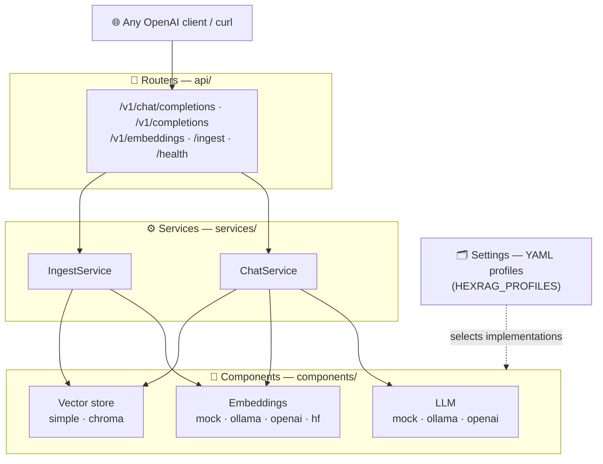
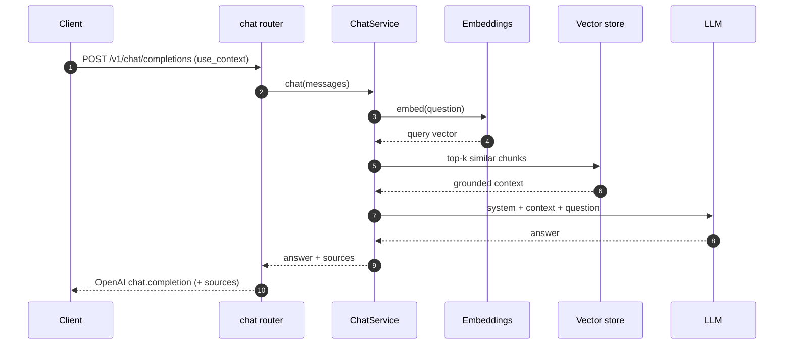

<div align="center">

# 🧩 hexrag

### Chat with your own documents — through an OpenAI-compatible API you can fully self-host.

A clean, layered **RAG** agent built on **FastAPI** + **LlamaIndex**.
Swap the LLM, embeddings, and vector store with a single line of config.

[](https://github.com/Krishmonpara/hexrag/actions/workflows/ci.yml)
[](https://www.python.org/)
[](https://fastapi.tiangolo.com/)
[](LICENSE)
[](https://github.com/astral-sh/ruff)
[](https://github.com/astral-sh/uv)

[🚀 Quickstart](#-quickstart) · [🔌 Backends](#-swap-backends) · [📡 API](#-api-reference) · [🧱 Architecture](#-architecture)

</div>

---

> [!TIP]
> **Zero setup to try it.** `git clone` → `uv sync` → `uv run hexrag`. The default
> profile uses a mock model + in-memory store, so it runs with **no API keys and no
> downloads**. Point a real backend at it whenever you're ready.

## 👀 See it in action

```bash
# 1 · ingest a document
curl -s localhost:8001/ingest/text -H 'Content-Type: application/json' \
  -d '{"file_name":"hex.txt","text":"Project Hex shipped v2 on June 1 2026."}'

# 2 · ask about it — answer is grounded in your docs, with sources attached
curl -s localhost:8001/v1/chat/completions -H 'Content-Type: application/json' \
  -d '{"messages":[{"role":"user","content":"When did Hex ship v2?"}],"use_context":true}'
```

```jsonc
{
  "object": "chat.completion",
  "model": "hexrag",
  "choices": [{
    "message": { "role": "assistant", "content": "Hex shipped v2 on June 1, 2026." },
    "finish_reason": "stop",
    "sources": [                          // ← which chunks grounded the answer
      { "score": 0.91, "file_name": "hex.txt",
        "text": "Project Hex shipped v2 on June 1 2026." }
    ]
  }]
}
```

> [!NOTE]
> The natural-language `content` above is what you get with a **real** backend
> (Ollama / OpenAI). The **mock** default returns a placeholder instead — but the
> retrieval, the `sources`, and the entire response shape are identical. Swapping is
> [one line of config](#-swap-backends).

## ✨ Why hexrag

|  |  |
|---|---|
| 🔋 **Batteries included** | Boots on a fresh clone with a mock LLM, mock embeddings, and an in-memory vector store. No keys, no model downloads. |
| 🔄 **Swap anything via config** | The LLM, embedding model, and vector store each change with **one line** — no code edits. |
| 🤝 **OpenAI-compatible** | `/v1/chat/completions` (+ streaming), `/v1/completions`, `/v1/embeddings`. Use any OpenAI SDK. |
| 🔒 **Truly self-hostable** | First-class **Ollama** backend for fully local, private inference. |
| 📎 **Grounded & cited** | Every RAG answer returns the source chunks (score, text, document) that informed it. |
| 🧪 **Production hygiene** | DI-decoupled layers, contract + end-to-end + schema tests, `ruff`, CI, and Docker. |

## 🚀 Quickstart

Needs [**uv**](https://docs.astral.sh/uv/) — it fetches the right Python for you.

```bash
git clone https://github.com/Krishmonpara/hexrag.git
cd hexrag
uv sync          # install
uv run hexrag    # serve on http://localhost:8001  (mock backend, no setup)
```

```bash
curl localhost:8001/health        # {"status":"ok"}
open http://localhost:8001/docs   # interactive Swagger UI
```

Prefer Make or Docker?

```bash
make run                     # = uv run hexrag   (see `make help` for more)
docker compose up --build    # containerized
```

Try the full RAG loop with the bundled sample document:

```bash
uv run python scripts/ingest.py sample_docs/hexrag-overview.md
curl localhost:8001/v1/chat/completions -H 'Content-Type: application/json' \
  -d '{"messages":[{"role":"user","content":"What three layers does hexrag use?"}],"use_context":true}'
```

## 🧱 Architecture

A strict three-layer onion wired by dependency injection. Each layer knows only the
one beneath it, so infrastructure is swappable and every piece is testable in isolation.



- **Routers** translate HTTP ↔ domain objects and nothing more.
- **Services** orchestrate (retrieve → assemble prompt → complete; or load → chunk → embed → store).
- **Components** are thin adapters behind LlamaIndex interfaces (`LLM`, `BaseEmbedding`, `BasePydanticVectorStore`), so a service depends on a *capability*, never a vendor.
- **Settings** profiles pick which concrete implementation each component builds.

## 🧠 How a question gets answered



## 🔌 Swap backends

Pick a profile with `HEXRAG_PROFILES`; it deep-merges `settings-<profile>.yaml` over
`settings.yaml`. No code changes.

| Concern | Setting | Options | Install |
|---|---|---|---|
| **LLM** | `llm.mode` | `mock` · `ollama` · `openai` | `--extra ollama` / `openai` |
| **Embeddings** | `embedding.mode` | `mock` · `ollama` · `openai` · `huggingface` | matching extra |
| **Vector store** | `vectorstore.database` | `simple` · `chroma` | `--extra chroma` |

<table>
<tr><th>🔒 Local & private — Ollama</th><th>☁️ OpenAI</th></tr>
<tr><td>

```bash
# install from https://ollama.com
ollama pull llama3.2
ollama pull nomic-embed-text

uv sync --extra ollama
HEXRAG_PROFILES=ollama uv run hexrag
```

</td><td>

```bash
uv sync --extra openai

HEXRAG_PROFILES=openai \
OPENAI_API_KEY=sk-... \
uv run hexrag
```

</td></tr>
</table>

## 📡 API reference

| Method & path | Description |
|---|---|
| `GET /health` | Liveness check |
| `POST /v1/chat/completions` | Chat — OpenAI-compatible, RAG via `use_context` (supports SSE streaming) |
| `POST /v1/completions` | Legacy text completion (delegates to chat) |
| `POST /v1/embeddings` | Embed text — OpenAI-compatible |
| `POST /ingest/text` | Ingest raw text |
| `POST /ingest/file` | Ingest an uploaded file |
| `GET /ingest/list` | List ingested documents |

Full interactive schema at **`/docs`** while the server runs.

## 🛠️ Development

```bash
make help      # list every target
make check     # ruff + tests
make format    # auto-fix & format
make wipe      # clear ingested data (local_data/)
```

The test suite (component contracts, end-to-end RAG, OpenAI schema shape, and
cross-restart persistence) runs **fully offline** against the mock profile.

<details>
<summary>📁 <b>Project structure</b></summary>

```
src/hexrag/
  main.py · launcher.py · di.py · paths.py
  settings/   loader.py  (profile merge + ${ENV})   models.py  (typed config tree)
  components/ llm.py  embedding.py  vector_store.py  node_store.py
  services/   ingest.py  chat.py  index.py
  api/        chat.py  completions.py  embeddings.py  ingest.py  health.py  openai_schema.py
  ui/         app.py    (optional Gradio chat UI — `--extra ui`)
tests/        contract · end-to-end · API-shape · persistence
scripts/      ingest.py (CLI)
settings*.yaml  default + mock / ollama / openai / test profiles
```

</details>

<details>
<summary>🤔 <b>Troubleshooting & FAQ</b></summary>

**`ModuleNotFoundError: No module named 'hexrag'` (path contains spaces).**
`uv`'s editable install uses a bare-path `.pth`, which Python may skip at startup if
the project's absolute path contains spaces. Clone into a space-free path, or install
non-editable:

```bash
UV_NO_EDITABLE=1 uv sync
UV_NO_EDITABLE=1 uv run hexrag
```

**Run commands from the project root.** Settings load from the current working
directory by default; or set `HEXRAG_SETTINGS_FOLDER=/path/to/settings`.

**Where is my ingested data?** In `local_data/` (vector store + doc store), persisted
between restarts. Remove it with `make wipe`.

**How do I add a new backend?** Add a branch in the relevant `components/*.py`, a
`mode` literal in `settings/models.py`, an optional extra in `pyproject.toml`, and a
profile YAML. See [CONTRIBUTING.md](CONTRIBUTING.md).

</details>

## 📄 License & credits

[Apache-2.0](LICENSE). hexrag began as a study of the architecture of
[PrivateGPT](https://github.com/zylon-ai/private-gpt) and was reimplemented from
scratch in its own structure and style.

<div align="center"><sub>Built with FastAPI · LlamaIndex · uv</sub></div>
